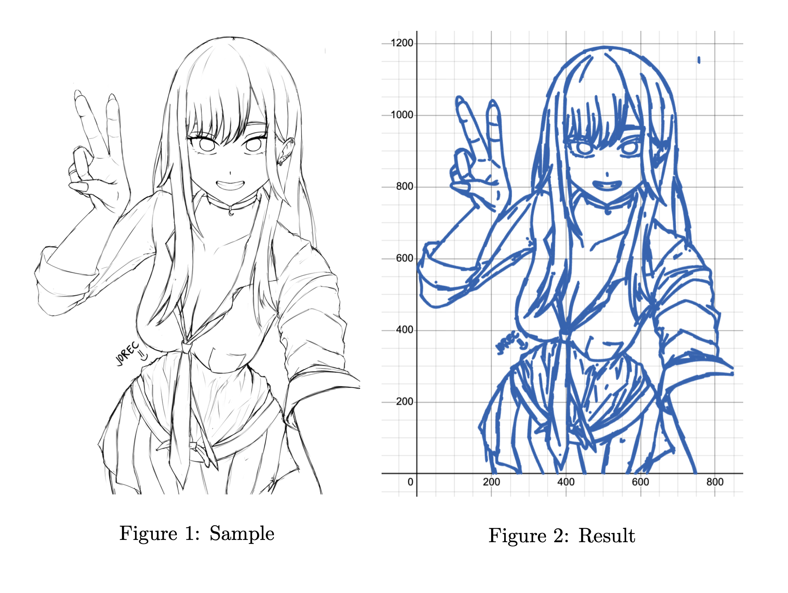

# Desmos Bezier Renderer (Mac)

Convert images and animations to Desmos graphs using Bezier curves. Uses Canny edge detection and Potrace to transform images into mathematical equations.



## Features

- **Browser upload** - Drag & drop or click to upload images directly in the browser
- **Multi-frame animation** - Upload multiple images at once to create animations
- **Dynamic reloading** - Update images and refresh the browser without restarting the server
- **macOS optimized** - Native setup using Homebrew

## Setup

### 1. Install Dependencies

```sh
# Install Homebrew (if not installed)
/bin/bash -c "$(curl -fsSL https://raw.githubusercontent.com/Homebrew/install/HEAD/install.sh)"

# Install system libraries
brew install potrace libagg
```

### 2. Clone & Install

```sh
git clone https://github.com/ChinesePrince07/DesmosBezierRenderer-mac.git
cd DesmosBezierRenderer-mac

# Install Python packages
pip3 install flask flask-cors numpy opencv-python-headless pillow pypotrace
```

## Usage

### Start the Server

```sh
python3 backend.py --yes
```

Open `http://127.0.0.1:5000/calculator` in your browser.

### Upload Images

Use the upload panel in the **bottom-right corner**:

1. **Single image**: Drop one image and click "Render Uploaded Image"
2. **Animation**: Select multiple images (they'll be sorted by filename) and click "Render X Frames"

Files are automatically named `frame1.png`, `frame2.png`, etc.

### Manual Method

Place images in the `frames` folder as `frame1.png`, `frame2.png`, etc., then set `f=1` in Desmos.

### Command Line Options

```
python3 backend.py -h

-f <dir>      Frame directory (default: frames)
-c <color>    Line color as hex (default: #2464b4)
-b            Bilateral filter for simpler renders
-l            L2 gradient for faster renders
-g            Hide background grid
--yes         Skip EULA prompt
--no-browser  Don't auto-open browser
```

## Troubleshooting

**Port 5000 in use:**
```sh
lsof -ti:5000 | xargs kill -9
```
Or disable AirPlay Receiver in System Settings > General > AirDrop & Handoff.

**pypotrace fails:**
```sh
brew install potrace libagg
```

## Example

```
  _____
 |  __ \
 | |  | | ___  ___ _ __ ___   ___  ___
 | |  | |/ _ \/ __| '_ ` _ \ / _ \/ __|
 | |__| |  __/\__ \ | | | | | (_) \__ \
 |_____/ \___||___/_| |_| |_|\___/|___/

                   BEZIER RENDERER
Andy 2025

Processing 1 frames...
--> Processing complete in 0.4 seconds

  http://127.0.0.1:5000/calculator
```


## License

MIT License. Andy 2025.
